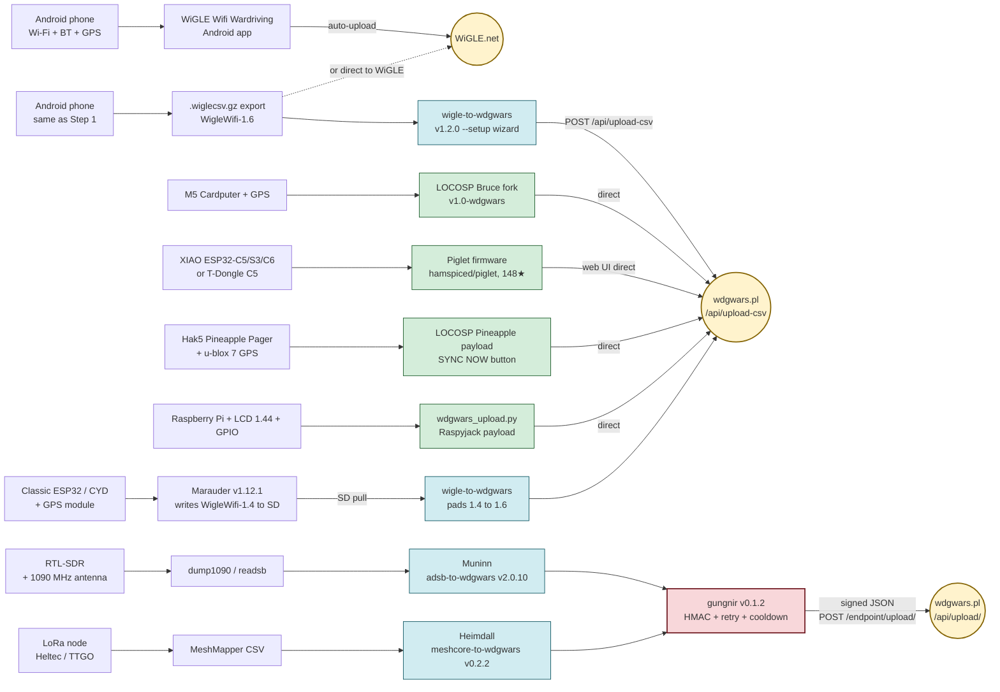

# Capture flow diagram

The same five-step progression from the [newcomer onramp](onramp.md), drawn as a flow. Each lane represents one onramp step.

If you're reading this in Obsidian, the [`.canvas` version](../wdgo-capture-flow.canvas) in the repo root has the same layout as an interactive board. The Mermaid version below renders directly in GitHub Pages.

## Reading the diagram

| Color | Meaning |
|---|---|
| Yellow | Destination endpoints (WiGLE.net, wdgwars.pl) |
| Green | On-device upload — no PC step needed |
| Blue | PC-side feeder — you upload from a computer |
| Red | Shared transport library (gungnir handles HMAC + retry + cooldown for the signed-JSON path) |

## Notes

- **One source can feed two destinations.** A WiGLE Android export is accepted by both WiGLE.net (direct) and wdgwars.pl (via wigle-to-wdgwars).
- **Two upload paths on wdgwars.pl side.** Bulk Wi-Fi/BLE CSVs go to `/api/upload-csv` (multipart). ADS-B + MeshCore go to `/api/upload/` as signed JSON via gungnir.
- **The `/endpoint/*` mirror exists** as a Cloudflare-L7 bypass for clients that burst-POST. gungnir v0.1.2+ uses it by default. Hand-rolled clients should target `/endpoint/*` rather than `/api/*` if they POST in bursts.

For the full progression with hardware suggestions and skill prerequisites at each level, see the [Newcomer onramp](onramp.md). For the firmware × chip support matrix behind each tier, see the [Hardware survey](survey.md).
