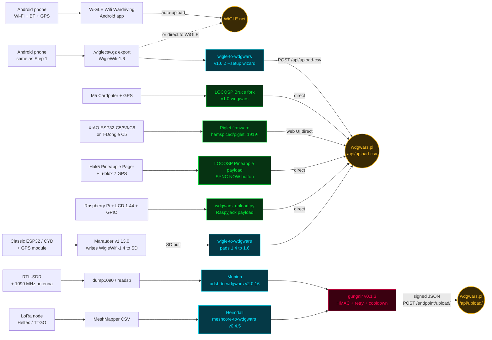

The same five-step progression from the [newcomer onramp](onramp.md), drawn as a flow. Each lane represents one onramp step.

If you're reading this in Obsidian, the [`.canvas` version](../wdgo-capture-flow.canvas) in the repo root has the same layout as an interactive board. The Mermaid version below renders directly in GitHub Pages.



## Reading the diagram

| Color | Meaning |
|---|---|
| Amber | Destination endpoints (WiGLE.net, wdgwars.pl) |
| Green | On-device upload — no PC step needed |
| Cyan | PC-side feeder — you upload from a computer |
| Pink | Shared transport library (gungnir handles HMAC + retry + cooldown for the signed-JSON path) |

## Notes

- **One source can feed two destinations.** A WiGLE Android export is accepted by both WiGLE.net (direct) and wdgwars.pl (via wigle-to-wdgwars).
- **Two upload paths on wdgwars.pl side.** Bulk Wi-Fi/BLE CSVs go to `/api/upload-csv` (multipart). ADS-B + MeshCore go to `/api/upload/` as signed JSON via gungnir.
- **The `/endpoint/*` mirror exists** as a Cloudflare-L7 bypass for clients that burst-POST. gungnir v0.1.2+ uses it by default. Hand-rolled clients should target `/endpoint/*` rather than `/api/*` if they POST in bursts.

For the full progression with hardware suggestions and skill prerequisites at each level, see the [Newcomer onramp](onramp.md). For the firmware × chip support matrix behind each tier, see the [Hardware survey](survey.md).

<script type="module">
  // GitHub Pages doesn't include Mermaid JS by default. This bootstrap finds
  // ```mermaid``` fenced code blocks (which Jekyll renders as
  // <pre><code class="language-mermaid">) and re-renders them as diagrams.
  // On the GitHub repo browser the script is stripped — GitHub's native
  // Markdown renderer already shows the diagram. So both contexts render.
  // Theme variables map onto the CRT brand palette so the diagram doesn't
  // look like a pastel sticker stuck on a black terminal.
  import mermaid from 'https://cdn.jsdelivr.net/npm/mermaid@10/dist/mermaid.esm.min.mjs';
  document.querySelectorAll('pre > code.language-mermaid').forEach((el) => {
    const div = document.createElement('div');
    div.className = 'mermaid';
    div.textContent = el.textContent;
    el.parentElement.replaceWith(div);
  });
  mermaid.initialize({
    startOnLoad: true,
    theme: 'base',
    themeVariables: {
      background: 'transparent',
      primaryColor: 'rgba(0,229,255,0.06)',
      primaryBorderColor: '#00e5ff',
      primaryTextColor: '#e0e0e0',
      secondaryColor: 'rgba(0,229,255,0.04)',
      tertiaryColor: 'rgba(0,229,255,0.02)',
      lineColor: 'rgba(0,229,255,0.45)',
      edgeLabelBackground: '#000',
      mainBkg: 'rgba(0,229,255,0.06)',
      nodeBorder: '#00e5ff',
      clusterBkg: 'rgba(0,229,255,0.03)',
      clusterBorder: 'rgba(0,229,255,0.30)',
      fontFamily: '"Share Tech Mono", ui-monospace, Consolas, monospace',
      fontSize: '13px'
    }
  });
</script>
