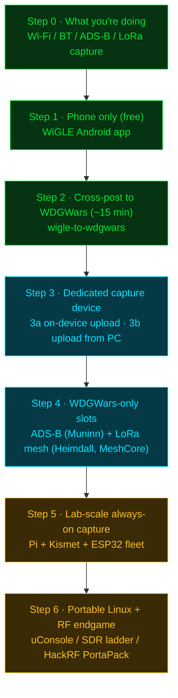

The fastest legitimate path from zero to scoring points on wdgwars.pl. Each level builds on the one before it. Stop wherever the next step doesn't sound fun yet, come back when it does.

> **Visual learner?** Open [Capture flow diagram](flow.md) for the same five-step progression as a flow diagram (capture device → firmware → destination). Renders in Obsidian as a canvas; readable as JSON anywhere else.

The whole ladder at a glance — each rung builds on the one below it. Green rungs are free or near-free, cyan adds a small hardware spend, amber is advanced / lab-scale:



## Step 0 — What you're actually doing

Wardriving is capturing wireless signals (Wi-Fi APs, Bluetooth devices, ADS-B aircraft, LoRa mesh nodes) while moving around. The hobby existed long before the game.

| Platform | Role |
|---|---|
| [WiGLE.net](https://wigle.net) | The long-running community database. Most veteran wardrivers say "I'm WiGLE'ing." Free hobby project, no ads. |
| [WDGWars (wdgwars.pl)](https://wdgwars.pl) | A community wardriving game by LOCOSP. Same captures, adds gang play, cell-grid territory, leaderboards, and accepts aircraft + LoRa mesh slots WiGLE doesn't have. |

You can play either, or both. Same hardware feeds both. The progression below points you at WiGLE first because it's the lowest-friction entry, then crosses you over to WDGWars without losing the WiGLE captures.

## Step 1 — Phone only (free)

The lowest-effort start.

**Android user:**
1. Install [WiGLE Wifi Wardriving](https://wigle.net/tools) from Google Play (the official app, by WiGLE)
2. Sign up at [wigle.net](https://wigle.net) for a free account
3. Open the app, grant Location + Wi-Fi permissions
4. Hit the scan toggle, then take a walk or drive
5. The app logs networks; uploads to WiGLE.net when you're back on Wi-Fi

**iPhone user:** there is no equivalent first-class WiGLE iOS app. Either borrow an Android device, ride along with an Android-running friend, or skip to Step 3 with a dedicated capture device.

**What this teaches:** the pace of capture, what RSSI looks like in practice, what "first to see" feels like when you find a network nobody's submitted before.

**Time to first WiGLE points:** under an hour if you live near anything populated.

## Step 2 — Cross-post the same captures to WDGWars (free, ~15 min one-time setup)

Same captures from Step 1, second leaderboard.

1. Make an account at [wdgwars.pl](https://wdgwars.pl)
2. Profile → API Keys → generate a 64-char key, save it
3. From WiGLE Android: Share → save the `.wiglecsv.gz` file to your PC
4. Install [wigle-to-wdgwars](https://github.com/Yggdrasil-AI-labs/wigle-to-wdgwars):
   - Linux/Mac: `./run.sh --setup`
   - Windows: `run.bat --setup`
   - The wizard prompts for both keys (WiGLE + WDGWars), validates them, optionally installs a daily timer
5. Drop the file in the watched directory, or run with `--schedule` for hands-off

That's it — one capture, two leaderboards.

**What this teaches:** how API keys work, the WigleWifi-1.6 CSV format, that the same data can feed multiple services.

## Step 3 — Dedicated capture device (small spend)

A handheld or pocket device that captures continuously without draining your phone battery. Two splits matter when picking:

1. **Does it upload on its own, or do you upload from PC?** (3a vs 3b below — affects workflow)
2. **Does it require soldering, or is everything plug-in?** (affects skill / time-to-first-capture)

If you don't solder and don't want to learn yet, the solderless paths are: M5 Cardputer + Bruce fork (3a Path A), Pineapple Pager (3a Path C), Raspyjack rig (3a Path D), Apex 5 (3b), Pwnagotchi (3b). The soldering paths add a 4-wire GPS hookup but unlock cheaper hardware — see [Shopping list](shopping.md) for the matrix.

### 3a. Easiest path: on-device upload

Four firmwares verified to upload directly to WDGWars from the capture device. All write WigleWifi-1.6 CSV and POST to `/api/upload-csv` with your API key.

| Hardware | Firmware | Form factor | How it uploads |
|---|---|---|---|
| **M5Stack Cardputer + GPS unit** | [LOCOSP Bruce fork](https://github.com/LOCOSP/bruce-firmware-wdgwars) tag [`v1.0-wdgwars`](https://github.com/LOCOSP/bruce-firmware-wdgwars/releases/tag/v1.0-wdgwars) | handheld with screen + keyboard | Set API key in device config (`bruceConfig.wdgwarsApiKey`), device uploads on its own when on Wi-Fi |
| **XIAO ESP32-C5 / S3 / C6 + GPS** OR **T-Dongle C5** | [Piglet](https://github.com/hamspiced/piglet) (198 stars as of 2026-07-25, actively shipping) | small dev board, controlled via web UI | Browser → device IP → paste API key → "Test Key" → "Upload All". "Get your API Key" link points directly at wdgwars.pl/profile. |
| **Hak5 WiFi Pineapple Pager + u-blox 7 USB GPS** | [LOCOSP Pineapple Pager payload](https://github.com/LOCOSP/pineapple_pager_wdgwars) | pocket | "SYNC NOW" upload button after you have a 3D GPS fix |
| **Raspberry Pi + LCD 1.44" + GPIO buttons (Raspyjack rig)** | [Raspyjack `payloads/exfiltration/wdgwars_upload.py`](https://github.com/7h30th3r0n3/Raspyjack/blob/main/payloads/exfiltration/wdgwars_upload.py) | small box | Payload script on the Raspyjack image |

There is also a fifth path where the **phone** does the uploading instead of the device:

| Hardware | Firmware | Form factor | How it uploads |
|---|---|---|---|
| **Biscuit Pro / Biscuit Ultra** ([biscuitshop.us](https://biscuitshop.us)), or a **DIY Biscuit** on any ESP32-C5 board with 8 MB flash + 8 MB PSRAM (T-Dongle C5, XIAO ESP32C5, Waveshare or generic C5 dev board) | Closed-source Biscuit firmware. DIY version is free, flashed from the browser at [flasher.biscuitshop.us](https://flasher.biscuitshop.us) | headless, no screen, pocket or bag | Paired phone app (iOS + Android) over Bluetooth. The phone supplies GPS and does the logging and uploading, so the board never needs Wi-Fi credentials or a GPS module. WiGLE goes over WiGLE's own API from the app. WDGWars uploads field-verified 2026-07-25 across Pro, Ultra, and the free DIY firmware, which is ahead of LOCOSP's [press page](https://wdgwars.pl/press) still saying *"integration in progress"*. Remaining tradeoff is that the firmware is closed source, so you are trusting the app rather than reading the code. |

If you're picking ONE for a clean newcomer experience, **Cardputer + Bruce fork** is the most turnkey (built-in keyboard + screen, no external web UI needed). If you like web dashboards over device menus, **Piglet on a XIAO C5** is the most modern. If you'd rather carry nothing with a screen and run everything from your phone, the Biscuit route is the least fiddly of all of them, at the cost of closed-source firmware you cannot audit. The Pineapple Pager path is best only if you already own a Pager.

### 3b. Cheapest path: capture-only, upload from PC

Buy less, do more steps per upload.

- Bare classic ESP32-WROOM, **or** a Cheap Yellow Display (CYD 2.8" / 2432S028), **or** an M5 StickC Plus
- Add a GPS module — [ESP32Marauder GPS wiki](https://github.com/justcallmekoko/ESP32Marauder/wiki/gps-modification) lists two tested ones (Teyleten Robot ATGM336H NEO-6M, DWEII GY-NEO6MV2) with pin-by-pin wiring
- Flash [Marauder v1.13.0](https://github.com/justcallmekoko/ESP32Marauder/releases/tag/v1.13.0) for your specific board
- Capture wardrive sessions, pull the SD card to your PC
- Run wigle-to-wdgwars on the SD dump

> **Critical: Marauder writes WigleWifi-1.4 with only 11 columns** (verified at [`WiFiScan.h:682`](https://github.com/justcallmekoko/ESP32Marauder/blob/master/esp32_marauder/WiFiScan.h#L682) — missing the `Frequency`, `RCOIs`, `MfgrId` that WDGWars expects from 1.6). wigle-to-wdgwars handles the padding, so this is not a blocker — just don't expect Marauder dumps to be byte-compatible with WiGLE web upload either.

> **Critical: Marauder needs a GPS module attached** or the wardrive dumps are empty (verified in source at [`WiFiScan.cpp:515-551`](https://github.com/justcallmekoko/ESP32Marauder/blob/master/esp32_marauder/WiFiScan.cpp#L515) — the `wardrive_line` is only written when `gps_obj.getGpsModuleStatus()` AND `getFixStatus()` are both true).

If you want a pre-flashed device without doing the GPS mod yourself, the [Apex 5](https://www.cnx-software.com/2026/02/11/esp32-marauder-5g-apex-5-module-for-flipper-zero-combines-esp32-c5-two-sub-ghz-radios-nrf24-and-gps/) is sold on Tindie at $99 (price per CNX Software, 2026-02-11 — re-check before buying) with Marauder + GPS already configured.

**What this teaches:** ESP32 flashing (esptool), GPS modules and antennas, the difference between "device uploads" and "you upload from PC", that not all firmwares produce the same CSV shape.

### 3c. Already own something else? It probably still plays

The five paths above are the ones with a WDGWars story out of the box. They are not the only firmwares that wardrive, and you do not need to rebuy hardware to join.

LOCOSP's [developer page](https://wdgwars.pl/press) accepts a raw WigleWifi-1.6 file at `POST /api/upload-csv` with your API key, and says outright that the CSV route is the recommended one for firmware. **So the working rule is: if your firmware writes a WigleWifi-format CSV, you're one upload away.** Pull the SD card, run [wigle-to-wdgwars](https://github.com/HiroAlleyCat/wigle-to-wdgwars), or drop the file into the upload form on your wdgwars.pl profile.

That covers a lot of hardware people already have on the shelf:

| If you have | Firmware to look at | What you get |
|---|---|---|
| A Cheap Yellow Display board | [HaleHound-CYD](https://github.com/JesseCHale/HaleHound-CYD) (browser flasher, GPS wardriving to SD, ALPR camera detection) or [ESP32-DIV](https://github.com/cifertech/ESP32-DIV) upstream | The cheapest capable handheld in the hobby, and the one with the most active firmware right now |
| A Cardputer or Cardputer ADV | [M5PORKCHOP](https://github.com/0ct0sec/M5PORKCHOP) WARHOG mode, or the LOCOSP Bruce fork from 3a | A second firmware to A/B against Bruce without buying anything |
| Any of 46 assorted ESP32 boards | [GhostESP Revival](https://github.com/GhostESP-Revival/GhostESP) (WiGLE CSV export; this is the maintained GhostESP, the original repo is archived) | Broadest board coverage of any single firmware |
| An M5Stack Atom GPS Kit | [AtomGPS Wigler](https://github.com/lozaning/AtomGPS_wigler) | Solderless, writes Wigle.net-compatible CSV, nothing else to configure |
| A Raspberry Pi and some adapters | [Dooku](https://github.com/NSM-Barii/Dooku) (Pi 5 + Kismet + 4 adapters), [warpi](https://github.com/designer2k2/warpi), or plain Kismet | Best capture quality per drive of anything on this page |
| A Pwnagotchi | [wardriver plugin](https://github.com/cyberartemio/wardriver-pwnagotchi-plugin) | Logs every network bettercap sees, not just handshakes, and uploads to WiGLE |
| An Android phone and no budget | You already did this in Step 1 | Genuinely fine. Plenty of leaderboard entries are phone captures |
| A Windows laptop | [Vistumbler](https://github.com/acalcutt/Vistumbler) | The one actively maintained Windows option |

The full catalog, including what each project's docs actually claim about output format (and where they claim nothing), is in [Hardware survey](survey.md) §3e. Maturity signals for the long-running projects are in §10 of the same doc.

## Step 4 — Pick up the WDGWars-only slots (aircraft + LoRa mesh)

WiGLE doesn't track aircraft or LoRa mesh nodes. WDGWars does. These are points only available on WDGWars.

| Slot | Tool | What you need |
|---|---|---|
| **Aircraft** (ADS-B) | [Muninn (adsb-to-wdgwars)](https://github.com/Yggdrasil-AI-labs/adsb-to-wdgwars) v2.2.1 | RTL-SDR USB dongle (~$30 typical) + 1090 MHz antenna + a small Linux box (Pi works). Run dump1090-fa or readsb to decode; Muninn watches the output directory and uploads. Stationary — mount the antenna where it has sky view. A HackRF PortaPack on Mayhem also works: capture to SD, convert afterward. |
| **LoRa mesh** (MeshCore or Meshtastic) | [Heimdall (meshcore-to-wdgwars)](https://github.com/Yggdrasil-AI-labs/meshcore-to-wdgwars) v0.8.1 for MeshCore; no dedicated Meshtastic feeder exists yet (§9 gap list) | LoRa node (Heltec / TTGO / Wio Tracker / similar). Point Heimdall at the MeshCore app's own database, which carries several times the nodes its JSON export does. MeshMapper CSV still works too. Uploads to the `meshcore_nodes` slot. Pocket-portable. |

**You do not have to install anything to use either feeder.** Both ship a browser version that converts your capture on your own machine and hands you a file to upload. Nothing leaves your computer, the conversion runs in the browser:

- Aircraft: [yggdrasil-ai-labs.github.io/adsb-to-wdgwars](https://yggdrasil-ai-labs.github.io/adsb-to-wdgwars/)
- Mesh: [yggdrasil-ai-labs.github.io/meshcore-to-wdgwars](https://yggdrasil-ai-labs.github.io/meshcore-to-wdgwars/)

Drag your capture onto the page, click **Download JSON**, then drag that file into the upload form on wdgwars.pl. No API key needed for that route. Use the CLI instead when you want scheduled or unattended uploads.

MeshCore and Meshtastic are both LoRa firmware, often on the same hardware, but they don't talk to each other over the air. As of 2026-08-12 the WDGWars mesh slot accepts records from either network, told apart by a `network` field. See [Hardware survey](survey.md) §1a for the contract. That's a server-side change; a feeder that speaks Meshtastic natively still needs to be written.

Both feeders also offer the signed-JSON path (HMAC envelope via gungnir) from the CLI, using the same API key as your other uploads.

**What this teaches:** that "wardriving" is broader than Wi-Fi — radio observation more generally. Aircraft is a stationary capture game; LoRa mesh is mobile. They reward different play styles.

## Step 5 — Lab-scale always-on capture

If you got here, you're not asking how to start. You're asking how to scale.

- Raspberry Pi 4 + Kismet with a monitor-mode USB Wi-Fi adapter for best capture quality
- A fleet of ESP32s on different channels and bands (mix of Bruce, Piglet, Marauder)
- Stationary ADS-B with an outdoor antenna for hundreds of nautical miles of range
- Multiple WDGWars API keys for split-driver attribution (one key = one driver — same key on two devices counts as one driver with two feeders)
- Alternative firmwares to test: [Evil-M5Project](https://github.com/7h30th3r0n3/Evil-M5Project), [Bruce upstream](https://github.com/BruceDevices/firmware), [Ghost_ESP](https://github.com/Spooks4576/Ghost_ESP)
- Custom feeders for sources nobody's built yet (see [Hardware survey](survey.md) §9 for the gap list)

For the full chip × firmware support matrix and the complete community tools catalog, jump to [Hardware survey](survey.md).

## Step 6 — Portable Linux + RF endgame

If you've gone through Steps 1–5 and still want more headroom, the hobby has two further directions. Both are optional and neither replaces Steps 1–4.

**Run the game + capture on the same handheld.** The LOCOSP [WatchDogsGo](https://github.com/LOCOSP/WatchDogsGo) game frontend is open source and the repo description names the [ClockworkPi uConsole](https://www.clockworkpi.com/product-page/uconsole-kit-rpi-cm4-lite) as a target platform. Pair the uConsole with a monitor-mode USB Wi-Fi adapter, a USB GPS receiver, and Kismet, and one handheld covers both sides of the hobby. A Steam Deck in Desktop Mode does roughly the same job if you already own one; a ClockworkPi DevTerm is the same compute platform in a keyboard-forward form factor.

**Upgrade the RF chain.** A bare RTL-SDR + the included whip antenna typically maxes out around 20–50 nm of ADS-B range. A real outdoor antenna (FlightAware 26"), an LNA mounted at the antenna, LMR-400 coax, and a lightning arrestor push that into the hundreds of nautical miles. The computer-attached SDR ladder runs AirSpy R2 / HF+ Discovery → SDRplay RSPdx-R2 / RSPduo → ADALM-Pluto → LimeSDR Mini 2.0 / USB → bladeRF 2.0 micro → Ettus USRP B200mini, with TX capability appearing from the Pluto onward. KrakenSDR + its 5-antenna array kit is the dedicated direction-finding option.

**Go handheld with the HackRF PortaPack.** A HackRF One in a PortaPack H4M / H2M shell with [Mayhem firmware](https://github.com/portapack-mayhem/mayhem-firmware) becomes a standalone capture + TX tool across 1 MHz–6 GHz with no computer attached. It doesn't upload to WDGWars on its own, but SD output flows to Muninn or wigle-to-wdgwars on a PC afterward.

See [Shopping list](shopping.md) Tiers 6–8 for the gear list at each step (including discone, log-periodic, Yagi antennas, RF filters, GPSDO, and [DragonOS Focal](https://sourceforge.net/projects/dragonos-focal/) for the software side). The associated form factors are also in [Hardware survey](survey.md) §6.

## Common newcomer pitfalls

| Pitfall | What's actually going on |
|---|---|
| Bought a bare ESP32-C3 and can't find good firmware | Marauder has no C3 binary. Bruce has no C3 port. GhostESP has a C3 binary but the output lacks BSSID on some commands. C3 is poorly served by stock firmware — avoid unless you want to write your own. |
| Bought a Flipper Zero expecting it to wardrive on its own | The Flipper has no 2.4 GHz radio. You need the WiFi DevBoard (or a side device like the Apex 5) running Marauder, plus a GPS module, plus an SD pull → wigle-to-wdgwars. See [Shopping list](shopping.md) Tier 3b. |
| Bought a Pwnagotchi expecting WiGLE CSV / WDGWars parity | Pwnagotchi captures PCAP handshakes, not the WigleWifi-1.6 CSV that wigle-to-wdgwars ingests. Use it for the handshake side of the hobby; pair it with a Marauder/Bruce rig if you also want leaderboard points. |
| Bought Meshtastic gear expecting Heimdall to ingest it | Heimdall only parses MeshCore exports today, but the WDGWars mesh slot itself takes Meshtastic too as of 2026-08-12 ([Hardware survey](survey.md) §1a). You no longer need to re-flash to MeshCore just to be accepted. What's missing is a feeder: nothing yet turns a Meshtastic export into the signed-JSON envelope. That gap is tracked at [Hardware survey](survey.md) §9. |
| Uploaded `ADSB.TXT` from a PortaPack and it was refused | The filename is not the format. `ADSB.TXT` is just what Mayhem calls the file; what matters is how the lines inside are laid out, and Mayhem writes its own layout rather than dump1090's. Run it through the converter first and upload the JSON it gives you. Reported by two players on 2026-08-14 on both Mayhem 2.0.2 and stable v2.4. |
| MeshCore uploads full of duplicates, or wiping the app database between uploads | Neither is necessary. Heimdall reads the app database directly and `--since-days N` skips anything older than you ask for, so you can upload repeatedly from the same database without re-sending your whole history. |
| Opened a capture in Excel or Sheets to check it, and now uploads are rejected | Re-saving a log in a spreadsheet rewrites the timestamps into a format the importer cannot read, or into dates in the future. Since 2026-07-10 those files are rejected up front with an explanation rather than importing junk. Upload the original export straight off the device; if you want to look at it first, open a copy. |
| Worried about hitting an upload cap | The daily cap applies only to brand new APs and sits at 500,000, raised from 20,000 and 6,000 before that. Re-scans of networks you already own always get through. |
| Bought Marauder without a GPS module | Wardrive dumps will be empty. GPS is mandatory, not optional. |
| Same API key on multiple devices | All captures attribute to one driver. Need separate keys for split-driver attribution. |
| Phone app reports "wrong password" | Could actually be Cloudflare returning 429 on a cold IP, not an auth failure. Try again after a minute. |
| Upload returned 429 in the middle of a batch | Stop the whole batch. Continuing makes the cooldown deeper. Pin gungnir >= v0.1.2 (uses `/endpoint/*` URLs which bypass CF L7) or hit `/endpoint/upload-csv` directly in your client. |


### Where the actual rules live

This guide is a community onramp, not the rulebook. The authoritative pages are
`/rules` and `/help` on wdgwars.pl, and both need you to be logged in, so sign up
first and read them there. `/rules#uploads` and `/help#daily-cap` are the sections
worth reading before your first big upload.

One page you can read without an account is the [changelog](https://wdgwars.pl/changelog/).
It is the best public record of what changed and when, and the two pitfalls above
were both announced there.

## Communities and creators

Wardriving is mostly figured out by talking to other wardrivers. The fastest way to get unstuck is a Discord; the fastest way to see what a rig looks like in motion is a YouTube channel.

### Where to ask

| Community | How to find it |
|---|---|
| WDGWars (LOCOSP) | DM `@locosp` on Discord, or use the contact channels at [wdgwars.pl/press](https://wdgwars.pl/press). LOCOSP runs the game and answers questions in the WDGWars Discord. |
| KokosStripClub (Marauder) | justcallmekoko's Discord, linked from [his GitHub profile](https://github.com/justcallmekoko). Marauder firmware questions live here. |
| Bruce | Active Discord, linked from the [BruceDevices/firmware README](https://github.com/BruceDevices/firmware). Bruce-specific build issues live here. |
| MeshCore | Discord linked from the [meshcore-dev/MeshCore README](https://github.com/meshcore-dev/MeshCore). LoRa node questions live here. |
| RTL-SDR Blog | [r/RTLSDR](https://old.reddit.com/r/RTLSDR/) is the most active community hub. No official Discord. |
| Flipper Zero | [flipperzero.one/discord](https://flipperzero.one/discord). |
| Hak5 | [hak5.org community links](https://hak5.org/pages/community-links) for the Discord plus the forums. |
| LAB5 / C5Lab (projectZero) | [C5Lab on GitHub](https://github.com/C5Lab) plus their [projectZero quick-start](https://c5lab.github.io/projectZero/) which lists the current Discord invite. Best place for ESP32-C5 Marauder add-on hardware questions (Flipper Pager + M5MonsterC5 for Cardputer/Tab5). |
| M5Stack (Cardputer / Tab5) | [m5stack.com](https://m5stack.com) homepage footer links the official M5Stack Discord. Vendor-official, broad scope across all M5 hardware. |
| Cardputer community (unofficial) | [terremoth/awesome-m5stack-cardputer README](https://github.com/terremoth/awesome-m5stack-cardputer) is the canonical hub and links the unofficial Cardputer Discord plus [r/CardPuter](https://www.reddit.com/r/CardPuter). Best place for Cardputer firmware comparisons. |

Discord invite links rot. When one is dead, the project's GitHub README is the durable place to look up the current invite.

### Creators worth following

Wardriving content is sparse on YouTube compared to nearby hobbies, so the short list below covers most of the active English-language signal. Watch one device comparison before you buy anything: it is cheaper than a wrong purchase.

| Creator | Where | What they cover |
|---|---|---|
| Talking Sasquach | [YouTube](https://www.youtube.com/@TalkingSasquach), [Odysee](https://odysee.com/@talkingsasquach:1) | The device shootouts. His [WDGWars device comparison](https://odysee.com/@talkingsasquach:1/i-tested-every-wardriving-device-for:f) puts Marauder, the Pineapple Pager, a Cardputer running Porkchop, HaleHound, Biscuit Pro, and Piglet against the same game. Also Flipper Zero and HackRF. |
| Valley Tech Solutions | [YouTube](https://www.youtube.com/@Valleytechsolutions) | WDGWars collabs, wardriving rigs, on-device walkthroughs. |
| justcallmekoko | [YouTube](https://www.youtube.com/justcallmekoko) | Marauder firmware demos and hardware tours from the firmware author. |
| GhostStrats (Spooks4576) | [YouTube](https://www.youtube.com/channel/UCzSZPWtTRA4G946XRAn2XLQ) | Ghost_ESP author. ESP firmware walkthroughs across many chips. |
| 7h30th3r0n3 | [YouTube](https://www.youtube.com/channel/UCN1sTrFbvdliXTUOsY5DkyA) | Evil-M5Project and Raspyjack demos from their author. |
| ringmast4r | [ringmast4r.org](https://ringmast4r.org), [substack](https://ringmast4r.substack.com), [Instagram](https://www.instagram.com/ringmast4r/) | Wardriving hobby coverage and personal-scale ops writeups. Video archive lives on-site, not on a YouTube channel. |

A longer list of channels, plus specific videos worth the click, is in [Credits](credits.md) under "YouTube and video coverage".

LOCOSP also maintains [wdgwars.pl/press](https://wdgwars.pl/press) for content creators covering the game, which is the canonical place to discover new WDGWars-specific coverage as it ships. **Making videos yourself?** Put `#wdgwars` in the title or description and LOCOSP's tracker auto-features them on the game map and the press page (RSS polling, roughly every 30 minutes, no approval step). One manual step first: DM `@locosp` on Discord or GitHub to get your channel added to the tracker, since only tracked channels get scanned.

### Community shops

The manufacturer storefronts already linked in [Shopping list](shopping.md) are usually cheapest and most direct. These resellers are worth knowing for pre-assembled or curated wardriving / red-team kits, or for region-specific shipping:

| Shop | Region | Why |
|---|---|---|
| [DSTIKE](https://dstike.com) (also [DSTIKE on Tindie](https://www.tindie.com/stores/dstike/)) | global | Pre-built ESP32 wardrivers, Deauthers, NugVR, and other purpose-built dev boards. |
| [Lab401](https://lab401.com) | EU | Exclusive EU distributor for Flipper Zero, Hak5, Proxmark. Avoids US-to-EU customs friction. |
| [Hacker Warehouse](https://hackerwarehouse.com) | US | Hak5, Flipper Zero, and wardriving accessories in one US-domestic store. |
| [LAB5 on Tindie](https://www.tindie.com/stores/lab/) and [lab5-11 Shopify](https://lab5-11.myshopify.com/) | EU (Wrocław PL), ships global | ESP32-C5 Marauder add-on PCBs: Flipper Pager mod and the M5MonsterC5 (C5 dual-band sub-1 GHz radio carrier for Cardputer ADV / Tab5). Pairs with their own [projectZero firmware](https://github.com/C5Lab). |
| [Biscuit Shop](https://biscuitshop.us) | US, ships global | Biscuit Pro and Ultra (app-driven, no screen, phone GPS), plus a CYD 2.8" Marauder/Bruce battery + GPS mod kit if you want the CYD path without doing the wiring. The [DIY Biscuit](https://biscuitshop.us/pages/diy-biscuits) firmware and web flasher are free for C5 boards you already own. |
| [HaleHound](https://halehound.com) | US | Complete built HaleHound units, including a 3.5" build, for people who want the firmware without sourcing a CYD plus modules. The [web flasher](https://flash.halehound.com/) is free if you'd rather build it yourself. |
| [Midwest Gadgets](https://www.midwestgadgets.org/product-page/piglet) | US | Carries the Piglet wardriver (the 3a Path B firmware) pre-built. |

For Cheap Yellow Display boards there is no canonical reseller. The community hub is [witnessmenow/ESP32-Cheap-Yellow-Display](https://github.com/witnessmenow/ESP32-Cheap-Yellow-Display); the boards themselves are sold through AliExpress, Amazon, and eBay.

> **Want your community, channel, or shop on this list?** Open an issue or PR at [github.com/HiroAlleyCat/wdgwars-onramp](https://github.com/HiroAlleyCat/wdgwars-onramp), or ask HiroAlleyCat (or another contributor) on the WDGWars Discord. We just need a primary source to verify (your README, channel About page, or storefront).

## Where to go next

- [Hardware survey](survey.md) — the reference doc behind this onramp. Full firmware × chip matrix, every community tool I could verify, decision tree.
- Writing a feeder in a new language? Read [gungnir](https://github.com/Yggdrasil-AI-labs/gungnir) (Python transport) and LOCOSP's [WatchDogsGo `plugins/wardrive_upload.py`](https://github.com/LOCOSP/WatchDogsGo/blob/main/plugins/wardrive_upload.py) side by side — between them they cover the auth header, HMAC construction, retry/cooldown, and the slot-typed payload shape.
- [WDGWars portal](https://wdgwars.pl) and [API help](https://wdgwars.pl/help/) — the source of truth for game mechanics and the API surface.

This progression is sequenced for points-per-effort, not skill-per-effort. A determined newcomer can skip directly to Step 3 if they're hardware-comfortable and don't want the Android phase. Don't over-prescribe to yourself.

<script type="module">
  // GitHub Pages doesn't include Mermaid JS by default. This bootstrap finds
  // ```mermaid``` fenced code blocks (which Jekyll renders as
  // <pre><code class="language-mermaid">) and re-renders them as diagrams.
  // On the GitHub repo browser the script is stripped — GitHub's native
  // Markdown renderer already shows the diagram. So both contexts render.
  import mermaid from 'https://cdn.jsdelivr.net/npm/mermaid@10/dist/mermaid.esm.min.mjs';
  document.querySelectorAll('pre > code.language-mermaid').forEach((el) => {
    const div = document.createElement('div');
    div.className = 'mermaid';
    div.textContent = el.textContent;
    el.parentElement.replaceWith(div);
  });
  mermaid.initialize({
    startOnLoad: true,
    theme: 'base',
    themeVariables: {
      background: 'transparent',
      primaryColor: 'rgba(0,229,255,0.06)',
      primaryBorderColor: '#00e5ff',
      primaryTextColor: '#e0e0e0',
      secondaryColor: 'rgba(0,229,255,0.04)',
      tertiaryColor: 'rgba(0,229,255,0.02)',
      lineColor: 'rgba(0,229,255,0.45)',
      edgeLabelBackground: '#000',
      mainBkg: 'rgba(0,229,255,0.06)',
      nodeBorder: '#00e5ff',
      clusterBkg: 'rgba(0,229,255,0.03)',
      clusterBorder: 'rgba(0,229,255,0.30)',
      fontFamily: '"Share Tech Mono", ui-monospace, Consolas, monospace',
      fontSize: '13px'
    }
  });
</script>
